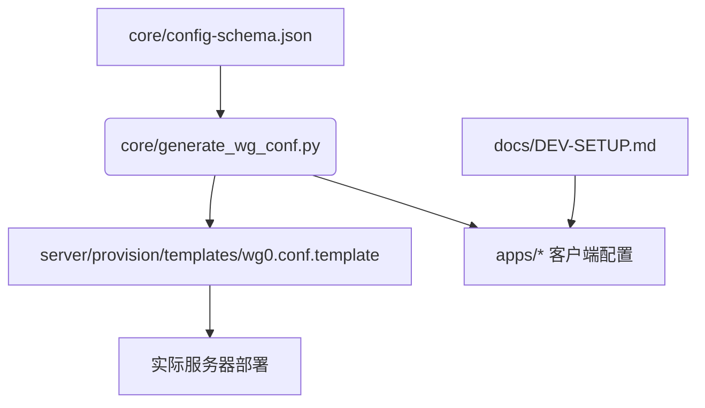

# 项目架构（占位说明）

> 这是占位实现：以下内容为 PrivateTunnel 架构的初步设想，后续迭代需要结合实际需求进行手工验证和细化。

## 总览

PrivateTunnel 采用分层架构：

- **Core**：集中管理配置模式与通用工具脚本，负责生成 WireGuard 配置、共享协议定义。
- **Server Provisioning**：提供服务器端部署脚本与模板，目标是支持多节点、灰度策略以及健康检查。
- **Client Apps**：包含 iOS/macOS/Windows（未来可扩展）应用壳，集成配置同步与连接控制。
- **Docs & Ops**：存放开发文档、运维指南以及架构决策记录。

## 组件关系

## 后续工作提示

- 补充配置管理方案（例如使用 GitOps/Ansible），确保生产环境可回滚。
- 设计健康检查与监控策略（Prometheus、Grafana、Heartbeat 等）。
- 明确客户端 UI/UX 需求，是否需要自定义分流策略界面。
- 评估安全需求：密钥轮换、访问控制、审计日志。
